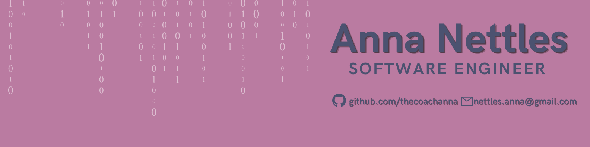

<h2 align="center">
Full stack software engineer and former body-positive personal trainer.
</h2>

    
    
    

### Projects:

<li><a href="https://workoutbuddy2.herokuapp.com/">WorkoutBuddy</a> - A web application that allows users to find fellow exercise enthusiasts in their area to meet up and workout with. It is a concept that is dear to me because of the difficulty I’ve experienced making friends in a new city and preferring to be active over just food + drinks.</li>
<li><a href="https://starting-strength-frontend.herokuapp.com/workouts/home">Starting Strength</a> - A 6 week workout program designed for true beginners to strength training including exercise videos, cues and a training tips page.</li>
<li><a href="https://thecoachanna.github.io/Matching-Game/">Exercise Matching Game</a> - A fun memory card matching game with a body diverse fitness theme.</li>
 

<em>In progress...</em>

<li><a href="https://github.com/thecoachanna/takehaction">Disabili-Buddy</a> - A project I had the opportunity to work on as part of Ada Developers Academy #TakeHaction Hackathon. Disabili-Buddy is an assistive tool designed to help disabled folx safely communicate with law enforcement. It is a project that I am really proud of because of its spotlight on mental health, inclusive design and support for the neurodivergent community.</li>

### I’m currently learning:

I was recently gifted a scholarship to Udacity's Cognizant Skills Accelerator Program. As someone who enjoys learning and is excited by the endless potential that exists in Tech, I'm looking forward to learning Java and diving deeper into Python.

### Languages + Tools:

### Fun fact:

I've lived in 12 different states in my adult life.

- Florida
- Mississippi
- Georgia
- North Carolina
- Ohio
- Missouri
- Maryland
- Michigan
- Texas
- Idaho
- Utah
- Hawaii

## GitHub Stats

